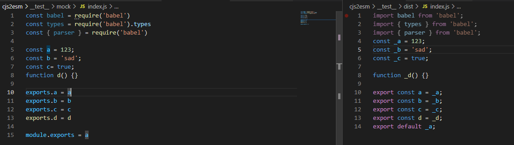

## 转换效果


## 安装

```cmd
npm i cjs2esmodule
// 或者
yarn add cjs2esmodule
```

## 使用

### 在vite中使用
该方式会使用 babel 转换 AST，所以如果速度慢的话，推荐使用脚本直接转换文件

```js
import { defineConfig } from 'vite'
import { cjs2esmVitePlugin } from 'cjs2esmodule'

// https://vitejs.dev/config/
export default defineConfig({
  plugins: [cjs2esmVitePlugin()]
})
```

### 使用脚本直接转换文件
底层使用了glob，所以文件匹配模式遵循 glob

```js
const { transformFiles } = require('cjs2esmodule')

transformFiles('./scripts/test.js')
// 支持数组
transformFiles(['./utils/*.js', './components/*.js'])
```
